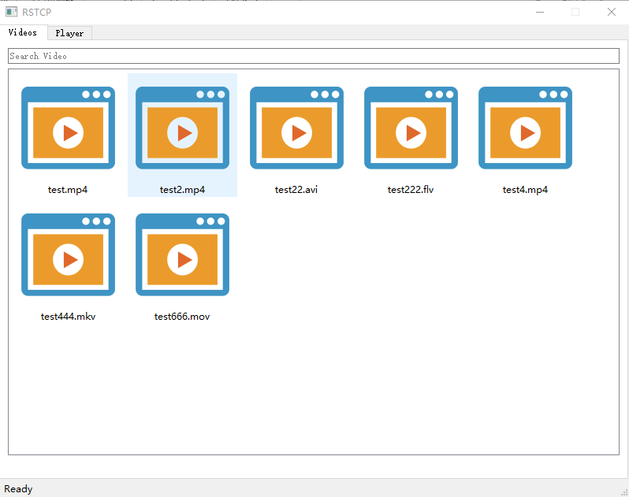
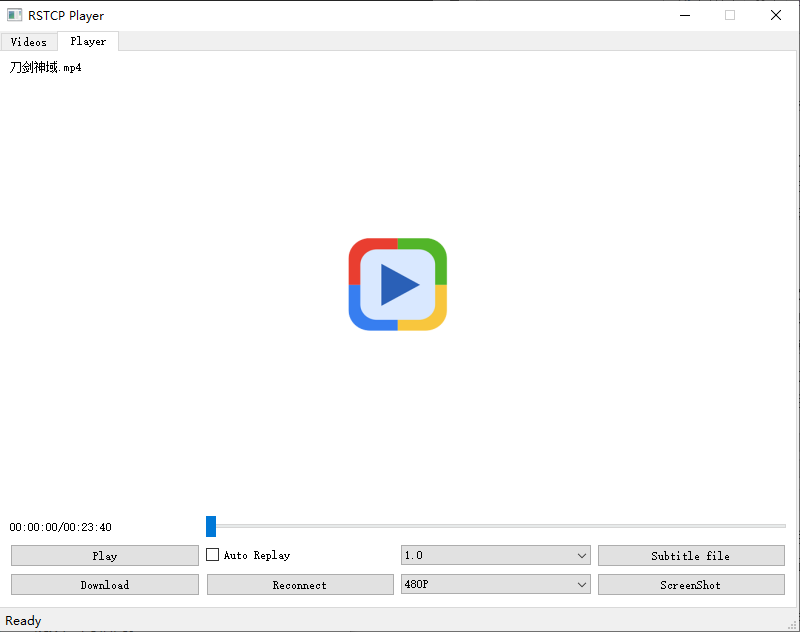
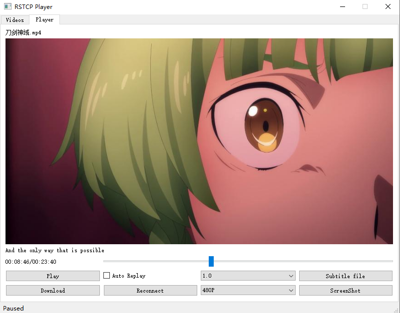
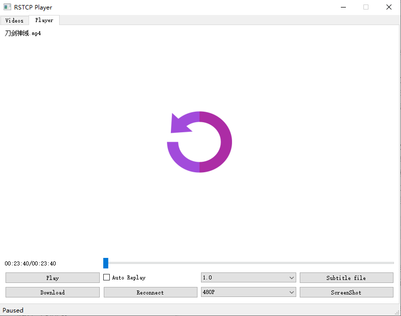
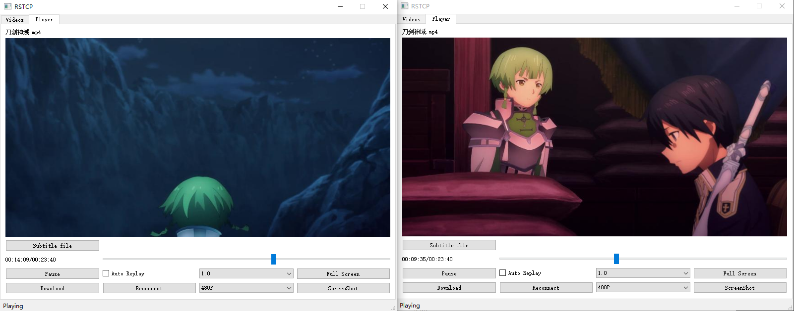

# 客户端使用方法

* 依赖包

  > cv2
  >
  > pyqt5
  >
  > numpy

* 首先需要运行服务端

* 运行客户端
```
# 运行客户端
python client.py serverrtspport serverftpport clientrtpport

# 例如
python client.py 554 521 10000
```

* 播放列表界面，支持搜索，双击播放，右键弹出菜单，播放过程中也可切回此页面选择想要播放的视频，支持历史播放记录



* 播放器界面，点击画面或者按钮进行播放



* 拖动时间轴调整播放位置，支持暂停，倍速，调整画质，下载，重连等。点击Subtitile file按钮可以打开本地.srt字幕，右侧则会显示相应字幕,与当前正在播放的视频时间轴同步



* 播放结束点击画面可以重播，勾选Auto Play将自动重播
* 支持多个客户端同时播放
```
# 运行多个客户端时，只要保证clientrtpport不同即可

# 例如
python client.py 554 521 11000
python client.py 554 521 12000
```



* 若视频播放过程发生连续丢包导致界面播放暂停按钮无响应，说明服务端正在进行包重发，若不希望重发过去的包，可以点击Reconnect重连。若将服务器关闭，客户端状态栏会提示点击播放器界面Reconnect按钮以重连，重新开启服务器后，点击Reconnect，视频将自动从上次播放的位置续播